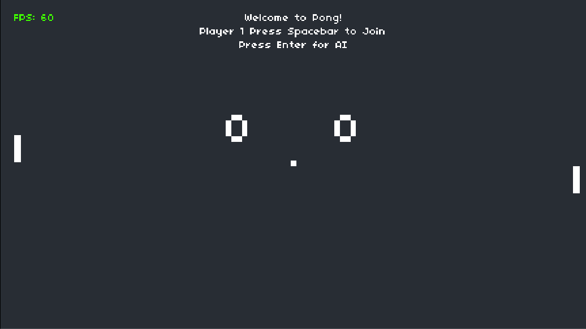

# edX CS50 Introduction to Game Development: Pong

This is the `Project 0` for [CS50's Introduction to Game Development](https://learning.edx.org/course/course-v1:HarvardX+CS50G+Games/home)

The goal is to take the provided [Love2D](https://love2d.org/) project of Pong and add AI features to at least one of the paddles.

## My Solution



I added the option to either or both players AI controlled by asking each player to join by hitting `Spacebar` or to use an AI player by hitting `Enter`.

This added two new states to the game:

- `p1` is the initial state where the game is waiting for Player 1 to decide if they want to join or use an AI player
- `p2` is the second state where the game is waiting for Player 2 to decide if they want to join or use an AI player

It also involved a small addition to the [`Paddle` class](./Paddle.lua) to add a `Paddle.ai` property that defaults to `false` and a `Paddle.isAi()` method that can be used to toggle the AI status of the paddle.

```lua
function Paddle:isAi(ai)
    if ai == nil then
        self.ai = false
    else
        self.ai = ai
    end
end
```

### AI Player Logic

The simplest and most naive approach seemed to be adding a conditional where the player movement is triggered, and if the player is an AI player, move the paddle based on it's relationship to the ball's `y` position.

#### Initial Attempt


The first attempt at implementing this logic resulted in a janky AI player that was constantly "vibrating" and moved in a way that felt unnatural.

```lua
-- player 1
if player1.ai then
    if ball.y < player1.y then
        player1.dy = -PADDLE_SPEED
    elseif ball.y > player1.y then
        player1.dy = PADDLE_SPEED
    else
        player1.dy = 0
    end
else
    if love.keyboard.isDown('w') then
        player1.dy = -PADDLE_SPEED
    elseif love.keyboard.isDown('s') then
        player1.dy = PADDLE_SPEED
    else
        player1.dy = 0
    end
end
```

#### Improved AI Player Logic


After realizing that the `y` position of the paddle and ball were both being calculated from the top left of each entity, I adjusted the logic to take into account both the height of the paddle and the height of the ball when caluclating the AI player's movement.


This resulted in smoother and more natural movement for the AI player.

```lua
-- player 1
if player1.ai then
    if ball.y + ball.height < player1.y then
        player1.dy = -PADDLE_SPEED
    elseif ball.y > player1.y + player1.height then
        player1.dy = PADDLE_SPEED
    else
        player1.dy = 0
    end
else
    if love.keyboard.isDown('w') then
        player1.dy = -PADDLE_SPEED
    elseif love.keyboard.isDown('s') then
        player1.dy = PADDLE_SPEED
    else
        player1.dy = 0
    end
end
```