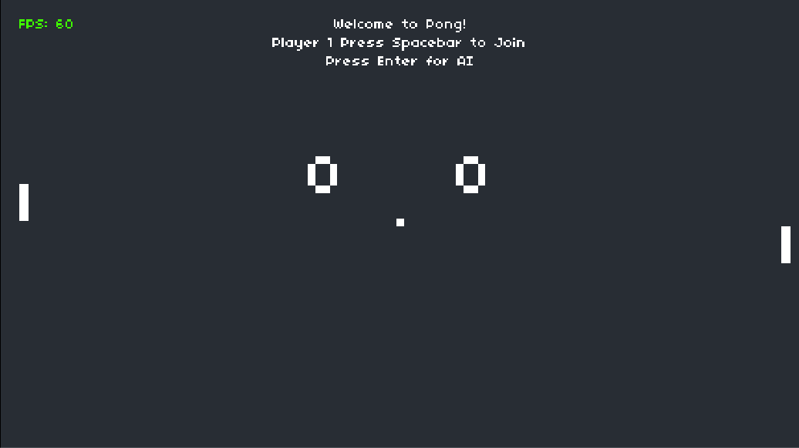
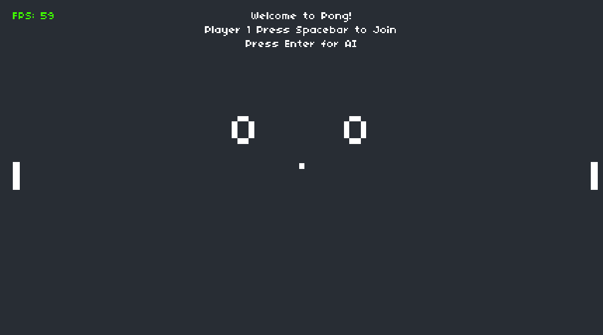
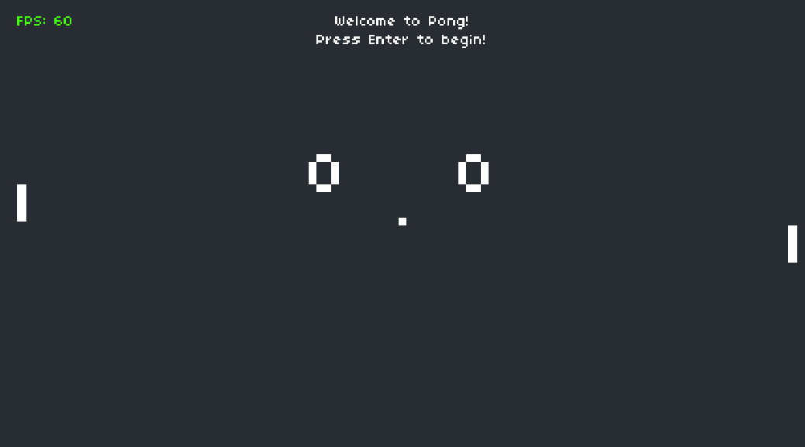
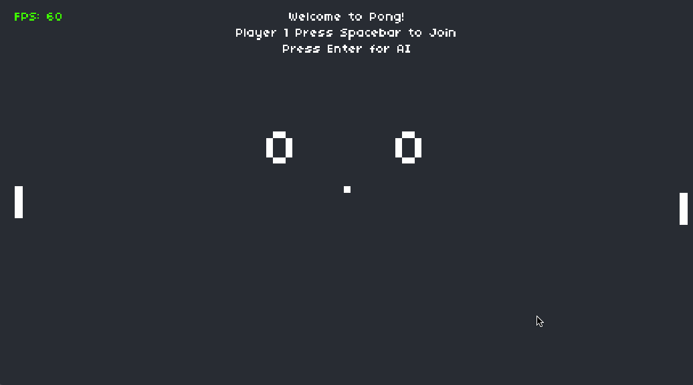

# edX CS50 Introduction to Game Development: Pong

This is the `Project 0` for [CS50's Introduction to Game Development](https://learning.edx.org/course/course-v1:HarvardX+CS50G+Games/home)

The goal is to take the provided [Love2D](https://love2d.org/) project of Pong and add AI features to at least one of the paddles.

## My Solution



I added the option to have one or both players controlled by AI by asking each player to join by hitting `Spacebar` or to choose an AI player by hitting `Enter`. Players can also choose between the Normal AI (which is quite good) and the Easy AI (which is still decent but plays more like a human).

This added two new states to the game:

- `p1` is the initial state where the game is waiting for Player 1 to decide if they want to join or use an AI player
- `p2` is the second state where the game is waiting for Player 2 to decide if they want to join or use an AI player

It also involved a small addition to the [`Paddle` class](./Paddle.lua) to add a `Paddle.ai` property that defaults to `false`, a `Paddle.level` property that defaults to `2`, and a [`Paddle.isAI()`](./Paddle.lua#L50-L63) method that can be used to toggle the AI status of the paddle and set it's AI level.

### AI Player Logic

The simplest and most naive approach seemed to be adding a conditional where the player movement is triggered, and if the player is an AI player, move the paddle based on it's relationship to the ball's `y` position.

#### Initial Attempt



The first attempt at implementing this logic resulted in a janky AI player that was constantly "vibrating" and moved in a way that felt unnatural.

```lua
-- player 1
if player1.ai then
    if ball.y < player1.y then
        player1.dy = -PADDLE_SPEED
    elseif ball.y > player1.y then
        player1.dy = PADDLE_SPEED
    else
        player1.dy = 0
    end
else
    -- human player 1 input
end
```

#### Improved AI Player Logic



After realizing that the `y` position of the paddle and ball were both being calculated from the top of each entity, I adjusted the logic to take into account both the height of the paddle and the height of the ball when calculating the AI player's movement.



This resulted in smoother and more natural movement for the AI player.

```lua
-- player 1
if player1.ai then
    if ball.y + ball.height < player1.y then
        player1.dy = -PADDLE_SPEED
    elseif ball.y > player1.y + player1.height then
        player1.dy = PADDLE_SPEED
    else
        player1.dy = 0
    end
else
    -- human player 1 input
end
```

#### One More Tweak

I also added some adjustments to how the AI player tries to position it's paddle, in order for more realistic play after observing the AI player in action taking some risky shots with the very edge of the paddle just touching the very edge of the ball.

To make the AI player perform more like a human, I adjusted it's logic, to make it prefer shots that are near the center of the paddle and used the center point of the ball, rather than the top edge, as it's target.

Using the center point also meant that as the ball got closer to the paddle's center point, the AI player would start to jitter as it tried to keep things perfectly centered. Adding some logic to stop the paddle from moving with the ball was within it's own height of the center point of the paddle, made the AI player's movement stop shaking.

```lua
ball_center = ball.y + ball.height / 2

-- player 1
if player1.ai then
    player1_center = player1.y + player1.height / 2

    if ball_center < player1_center then
        player1.dy = -PADDLE_SPEED
    elseif ball_center > player1_center then
        player1.dy = PADDLE_SPEED
    else
        player1.dy = 0
    end

    if math.abs(ball_center - player1_center) < ball.height then
        player1.dy = 0
    end
else
  -- human player 1 input
end
```

#### AI Difficulty Level


After watching the two AI paddles play absolutely perfect games - only losing a point in rare cases where the ball could get moving too fast for the paddle's movement speed (or in some cases getting so fast that the collision detection logic would fail) - I decided to add a more lenient difficulty level to the AI players, too.

**Note**: Fixing the collision detection logic is beyond the scope of the project, so I focused on the paddle logic, but will revisit the collision detection in the future.

I tweaked the AI player logic to add some simulated slower reaction time and then added a `Paddle.level` property that defaults to `1` (Easy Mode w/ slower reaction time), but can also be set to `2` (Hard Mode w/ centered paddle logic) and updated the `Paddle.isAI()` method to also accept the level the AI should be initialized at.

This easier paddle is still a challenge, but giving it a little bit of hesitation (by about 3/4 of the ball's height) and still using the top and bottom of the paddle as the target rather than the center, makes it a bit more human-like and less perfect in it's playstyle.

```lua
ball_center = ball.y + ball.height / 2

-- player 1
if player1.ai then
    -- Normal AI
    if player1.level == 2 then
        player1_center = player1.y + player1.height / 2

        if ball_center < player1_center then
            player1.dy = -PADDLE_SPEED
        elseif ball_center > player1_center then
            player1.dy = PADDLE_SPEED
        else
            player1.dy = 0
        end

        if math.abs(ball_center - player1_center) < ball.height then
            player1.dy = 0
        end
    -- Easy AI
    else
        player1_bottom = player1.y + player1.height

        if ball_center < player1.y - ball.height * 0.75 then
            player1.dy = -PADDLE_SPEED
        elseif ball_center > player1_bottom + ball.height * 0.75 then
            player1.dy = PADDLE_SPEED
        else
            player1.dy = 0
        end
    end
else
    -- human player 1 input
end
```